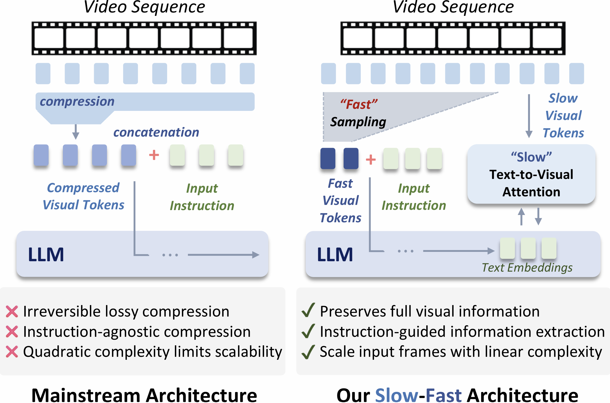
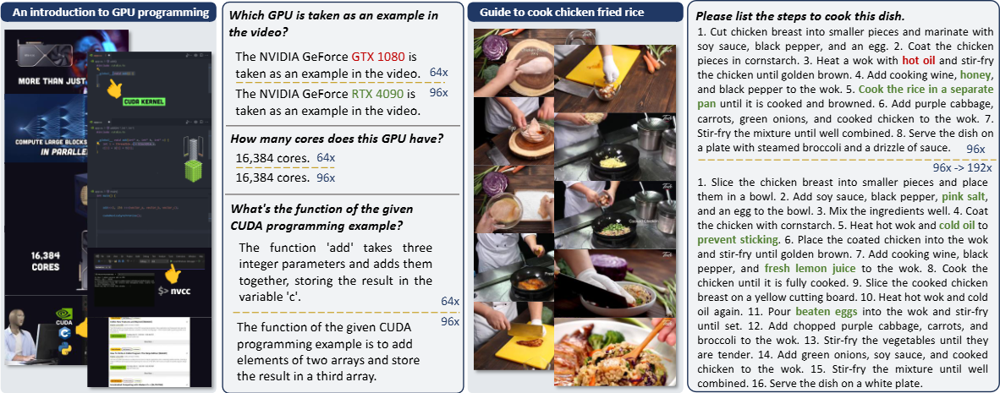
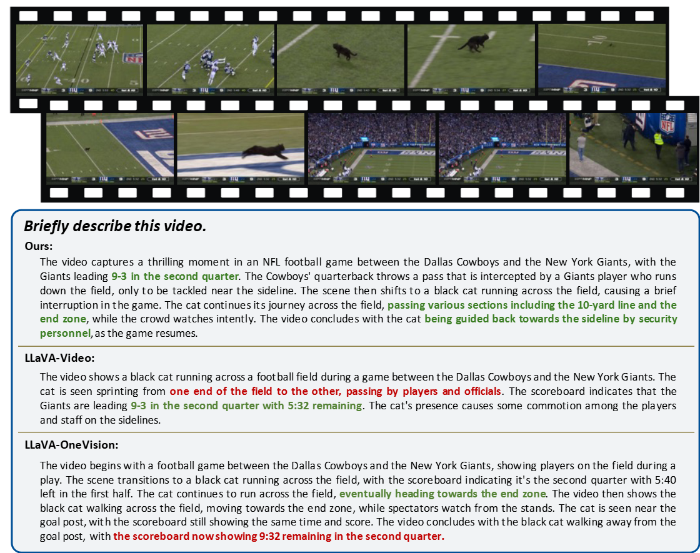

<div align="center">

# Slow-Fast Architecture for Video Multi-Modal Large Language Models

</div>
<!-- <p align="center" width="100%"> -->
<!--  -->
<!-- </p> -->

---

[](https://github.com/tatsu-lab/stanford_alpaca/blob/main/LICENSE)
[](MODEL_LICENSE)

[[arXiv](https://arxiv.org/abs/2504.01328v1)] [[HuggingFace](https://huggingface.co/collections/shi-labs/slow-fast-video-mllm-67ef347a28772734c15a78b5)]

## Highlights
- A novel architecture for video understanding MLLMs that bypass the sequence length limitations of LLMs.
- Easily adaptable and compatible with most MLLMs, such as the widely-used LLaVA architectures.
- Instruction-aware extraction of visual information from uncompressed video representation.
- Capable of analyzing over 1,536 frames during inference without additional compression (64 tokens per frame using a SigLIP encoder, totaling 98k sequence length).

<div align="center">

</div>

## Introduction
Balancing temporal resolution and spatial detail under limited compute budget remains a key challenge for video-based multi-modal large language models (MLLMs). Existing methods typically compress video representations using predefined rules before feeding them into the LLM, resulting in irreversible information loss and often ignoring input instructions. To address this, we propose a novel slow-fast architecture that naturally circumvents this trade-off, enabling the use of more input frames while preserving spatial details. Inspired by how humans first skim a video before focusing on relevant parts, our slow-fast design employs a dual-token strategy: 1) "fast" visual tokens — a compact set of compressed video features — are fed into the LLM alongside text embeddings to provide a quick overview; 2) "slow" visual tokens — uncompressed video features — are cross-attended by text embeddings through specially designed hybrid decoder layers, enabling instruction-aware extraction of relevant visual details with linear complexity. We conduct systematic exploration to optimize both the overall architecture and key components. Experiments show that our model significantly outperforms self-attention-only baselines, extending the input capacity from 16 to 128 frames with just a 3% increase in LLM's prefilling computation, and achieving a 16% average performance improvement across five video understanding benchmarks.

## Updates
- [TODO] Evaluation code for different benchmarks.
- [TODO] Model checkpoints and online demo.
- [TODO] Training and Inference Code.

## Contents
- [Install](#install)
- [Models & Performance](#models--performance)
- [Visual Examples](#visual-examples)


## Models & Performance
We provide the pretrained models on huggingface hub, which are listed in the following table. All the models use [Qwen2-7B-Instruct](https://huggingface.co/Qwen/Qwen2-7B-Instruct) as the base LLM.


|    Link    | Frames | Sampling Stride | Pooling Stride | VideoMME | VideoMME-sub | MLVU | MVBench | EgoSchema | LongVideoBench | Perception Test | Next-QA | ActivityNetQA | TempCompass |
|:----------:|:------:|:---------------:|:--------------:|:--------:|:------------:|:----:|:-------:|:---------:|:--------------:|:---------------:|:-------:|:-------------:|:-----------:|
| [Checkpoint](https://huggingface.co/shi-labs/slowfast-video-mllm-qwen2-7b-convnext-576-frame64-s1t4) |   64   |        1        |        4       |   60.2   |     63.0     | 67.3 |   68.9  |    59.2   |      56.6    |       70.3      |   83.5  |      54.8     |     68.9    |
| [Checkpoint](https://huggingface.co/shi-labs/slowfast-video-mllm-qwen2-7b-convnext-576-frame96-s1t6) |   96   |        1        |        6       |   60.3   |     63.4     | 68.1 |   68.6  |    59.8   |      58.0    |       70.2      |   83.1  |      54.5     |     67.7    |

### Comparsion with Other Models
|      Name      |       LLM      |  MME | MME-sub | MLVU | MVBench | EgoSchema | LongVidBench | Per. Test | Next-QA | ActNetQA | Tempcompass |
|:--------------:|:--------------:|:----:|:-------:|:----:|:-------:|:---------:|:------------:|:---------:|:-------:|:--------:|:-----------:|
|     GPT-4O     |        -       | 59.9 |   63.3  |   -  |    -    |     -     |       -      |     -     |    -    |   57.0   |     70.9    |
|      VILA      |     Yi-34B     | 60.1 |   61.1  | 56.7 |    -    |    58.0   |       -      |    54.0   |   67.9  |   58.0   |      -      |
|     PLLaVA     |     Yi-34B     |   -  |    -    |   -  |   58.1  |     -     |     53.2     |     -     |    -    |   60.9   |      -      |
|     LongVA     |    Qwen2-7B    | 52.6 |   54.3  | 56.3 |    -    |     -     |       -      |     -     |   68.3  |   50.0   |      -      |
|     IXC-2.5    |  InternLM2-7B  | 55.8 |   58.8  | 37.3 |   69.1  |     -     |       -      |    34.4   |   71.0  |   52.8   |      -      |
| SlowFast-LLaVA |    Qwen2-7B    |   -  |    -    |   -  |    -    |    47.2   |       -      |     -     |   64.2  |   55.5   |      -      |
| SlowFast-LLaVA |     Yi-34B     |   -  |    -    |   -  |    -    |    55.8   |       -      |     -     |   66.2  |   59.2   |      -      |
|    LLaVA-OV    |    Qwen2-7B    | 58.2 |   61.5  | 64.7 |   56.7  |    60.1   |     56.5     |    57.1   |   79.4  |   56.6   |     64.8    |
|   VideoLLaMA2  |    Qwen2-7B    | 47.9 |   50.3  | 32.7 |   54.6  |    51.7   |       -      |    51.4   |    -    |   50.2   |      -      |
|    Kangoroo    |    LLaMA3-8B   | 56.0 |   57.6  | 61.0 |   61.1  |    62.7   |     54.8     |     -     |    -    |     -    |     61.3    |
|    Oryx-MLLM   |    Qwen2-7B    | 58.3 |   62.6  | 67.5 |   63.9  |     -     |     55.3     |    68.6   |   81.9  |     -    |      -      |
|   mplug-owl3   |    Qwen2-7B    | 53.5 |    -    |   -  |   54.5  |     -     |     52.1     |     -     |   78.6  |     -    |      -      |
|  **Slow-Fast Video MLLM** |  |      |         |      |         |           |              |           |         |          |             |
|    64 Frame    |    Qwen2-7B    | 60.2 |   63.0  | 67.3 |   68.9  |    59.2   |     56.6     |    70.3   |   83.5  |   54.8   |     68.9    |
|    96 Frame    |    Qwen2-7B    | 60.3 |   63.4  | 68.1 |   68.6  |    59.8   |     58.0     |    70.2   |   83.1  |   54.5   |     67.7    |

## Visual Examples

<div align="center">

</div><br>

<div align="center">

</div><br>


## Install
Please following the guide here to prepare the environment on **Linux OS**.

1. Clone this repository
```bash
git clone https://github.com/SHI-Labs/Slow-Fast-Video-Multimodal-LLM.git
cd Slow-Fast-Video-Multimodal-LLM
```

2. Create environment and install package
```Shell
conda create -n slowfast_mllm python=3.10 -y
conda activate slowfast_mllm
pip install --upgrade pip  # enable PEP 660 support
pip install -r requirements.txt
```
Note that we use CUDA 12.2 to set up the python environment. Other version of CUDA, Pytorch, and transformers library may also works, but we didn't test the performance under these scenorias.

3. Install additional packages for training cases
```
pip install flash-attn==2.4.2 --no-build-isolation
pip install deepspeed==0.14.2
```


## Training Data
We are currently preparing the dataset in the following format. But you can prepare the data in the following format to start the training. The annotation file should be a single json file containing a list of dict with the following format:
```json
{
    {
        'video':"${VIDEO_PATH}",
        'conversation':{
            {
                'from': "human",
                'value': "Describe this video in detail."
            },
            {
                'from': "gpt",
                'value': "This is a dummy annotation."
            },
        }
    },
    ...
}
```

## Training

We are currently organizing the code and will release the code soon!


## License
[](https://github.com/tatsu-lab/stanford_alpaca/blob/main/LICENSE)
**Usage and License Notices**: This project utilizes certain datasets and checkpoints that are subject to their respective original licenses. Users must comply with all terms and conditions of these original licenses, including but not limited to the [OpenAI Terms of Use](https://openai.com/policies/terms-of-use) for the dataset and the specific licenses for base language model. This project does not impose any additional constraints beyond those stipulated in the original licenses. Furthermore, users are reminded to ensure that their use of the dataset and checkpoints is in compliance with all applicable laws and regulations.


## Acknowledgement

- [LLaVA](https://github.com/haotian-liu/LLaVA): the codebase we built upon.
- [Eagle](https://github.com/NVlabs/EAGLE): the codebase we built upon.
- [OpenFlamingo](https://github.com/mlfoundations/open_flamingo): the hybrid layer implementation borrow some code from open flamingo.
- [mPLUG-Owl3](https://github.com/X-PLUG/mPLUG-Owl/tree/main/mPLUG-Owl3): we borrow some of the code from them to implement hybrid decoder layer.
- [LLaVA-Video-178K](https://llava-vl.github.io/blog/2024-09-30-llava-video/): we train our model with the data from LLaVA-Video-178k.
- [VideoChat2](https://github.com/OpenGVLab/Ask-Anything): we train our model with part of the data organized by VideoChat2.
- [LMMs-Eval](https://github.com/EvolvingLMMs-Lab/lmms-eval): many thanks to the LMMs-Lab for their wonderful and easy-to-use evaluation tools!
